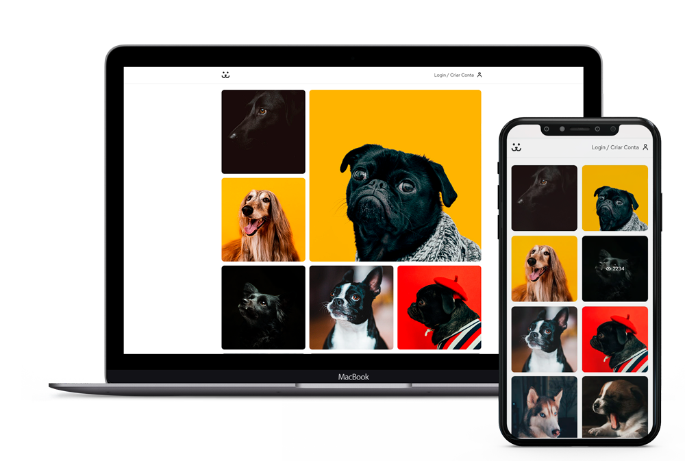

<div>
<h1 align="center">
   <b>Dogs</b>
  <br><br>
</h1>
<p align="center">Uma rede social para compartilhar fotos do seu pet ❤️ </p><br>
</div>

<p align="center">
 <a href="#sobre">Sobre</a> • 
 <a href="#instalacao">Instalação</a> 
</p>

<p align="center">
  
</p>

Quer ver como ficou? Só entrar nesse [link](https://dogs-740i5f07p-tainas-projects-ba576a67.vercel.app)

# 💻 Sobre

Uma rede social para compartilhar fotos de seus amigos caninos. <br>
Onde o usuário pode se cadastrar, fazer uploads das suas imagens e ter estatisticas do seu perfil e do quanto ele foi visualizado.<br>
Projeto realizado na conclusão do curso React Completo da escola Origamid. 💜<br><br>

# 🚀 Instalação

Para baixar o projeto siga as instruções abaixo:

```sh
git clone https://github.com/TainaIsabela/Dogs.git

cd Dogs
```

Instale as dependências e inicie o projeto:

```sh
npm install
npm start
```
